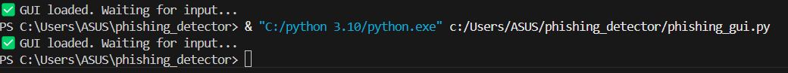
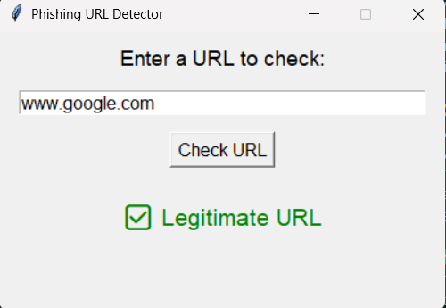

# 🛡️ Phishing_Detector - Phishing URL Detection Tool

PhishGuard is a simple tool to detect phishing URLs using rule-based and ML methods. It includes a GUI using Tkinter.

---

## 🔍 Features

- ✅ Rule-based phishing detection  
- 🤖 ML with Random Forest  
- 🖥 GUI using Tkinter  
- 📊 Real-world Kaggle dataset  

---

## 📸 Screenshots

### Terminal Output  


### 🖥️ GUI Interface  


---

## 💡 Run Locally

```bash
pip install pandas scikit-learn
python phishing_gui.py
